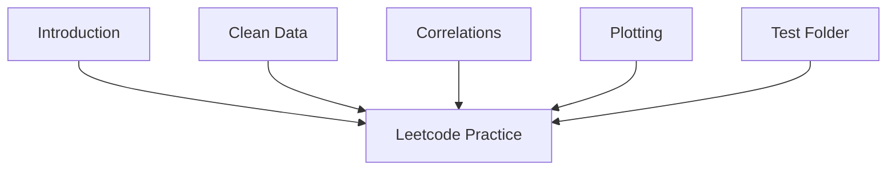

## 1. Stack
- Language: Python 3 (per README.md Setup section: `python3`, `.venv`).
- Key library: `pandas` (installed via `pip install pandas`).
- Optional libs (README.md): `jupyter`, `matplotlib`, `seaborn`.
- No package manifest present (no package.json/pyproject.toml/requirements.txt found at REPO_ROOT).

## 2. Directory map

| Path | What lives there |
|---|---|
| Clean Data/ | Data-cleaning scripts: EmptyCells.py, RevovingDuplicates.py, WrongData.py, WrongFormat.py + data.csv |
| Correlations/ | correlation.py + data.csv |
| Introduction/Load CSV file/ | check.py + data.csv |
| Introduction/Red CSV and DataFrame/ | main.py + data.csv |
| Plotting/ | plot.py + data.csv |
| Test Folder/ | main.py, plot_demo.py, data.csv, data.json, plot.png, plot_duration_vs_calories.png |
| PANDAS_LEETCODE_PRACTICE.md | LeetCode-style pandas practice notes |
| README.md | Project overview, learning path, setup instructions |

## 3. Diagram

(Root `README.md` describes and links all topic folders; not a diagram node since it is the existing repo README, not a separate component.)

## 4. Component index
- [[Introduction]]
- [[Clean Data]]
- [[Correlations]]
- [[Plotting]]
- [[Test Folder]]
- [[Leetcode Practice]]

## 5. Entry points
- No src/ or app/ folder exists, and no root-level main.*/index.*/app.* file exists at REPO_ROOT — no conventional single entry point found.
- Dev: run any topic script directly with the local venv Python, e.g. `python "Test Folder/main.py"` or `python "Introduction/Red CSV and DataFrame/main.py"` (paths confirmed via directory listing; script contents out of scope, not read).
- Prod: none observed — README.md's Setup section documents only a local `.venv` for running scripts, no build/deploy step.

## 6. Conventions
- Each topic folder ships its own local `data.csv` sample dataset (observed in Clean Data/, Correlations/, Introduction/Load CSV file/, Introduction/Red CSV and DataFrame/, Plotting/, Test Folder/) — datasets are not shared across folders.
- README.md's "Suggested Repository Structure" proposes lowercase, hyphen-free folders (`notes/`, `examples/`, `exercises/`, `mini-projects/`), but the actual top-level folders use Title Case names with spaces (`Clean Data`, `Test Folder`, `Introduction/Load CSV file`) — the suggestion in README.md is not followed in practice.
- Dependency setup convention: `.venv` virtual environment, `pip install pandas` (README.md Setup section).
- Error handling: TODO: verify (script internals are out of scope for this pass; not read).

## 7. Where things go
- Add a new pandas topic: create a new top-level folder (Title Case, spaces allowed) with its own script(s) and local `data.csv`, following the pattern in `Clean Data/`, `Correlations/`, `Plotting/`.
- Add a new data-cleaning example: add a `.py` file inside `Clean Data/` alongside the existing scripts.
- Add LeetCode-style practice problems: edit `PANDAS_LEETCODE_PRACTICE.md`.
- Add scratch/experimental code: use `Test Folder/` (existing precedent: main.py, plot_demo.py).
- Update setup/dependency instructions: edit the Setup section of `README.md`.
